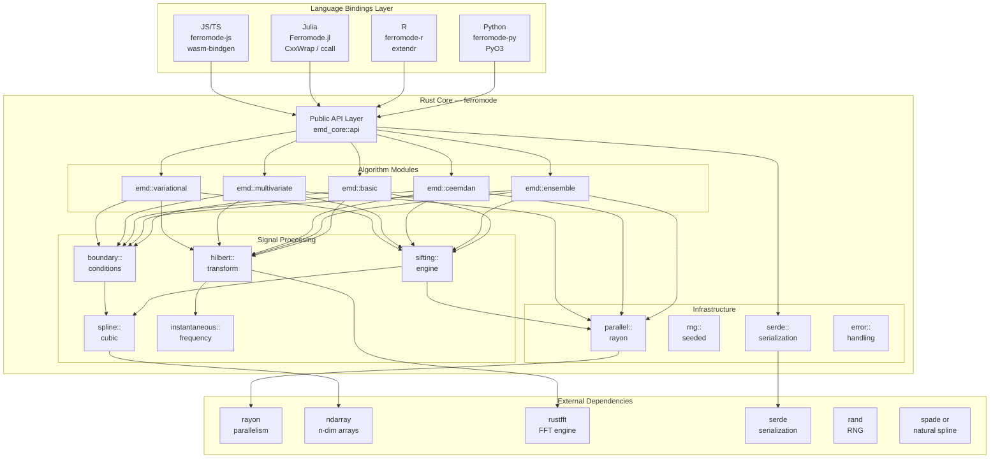
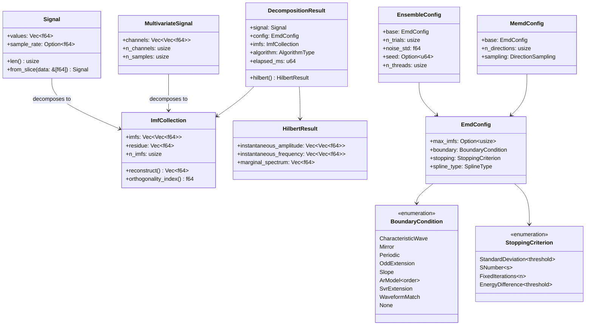
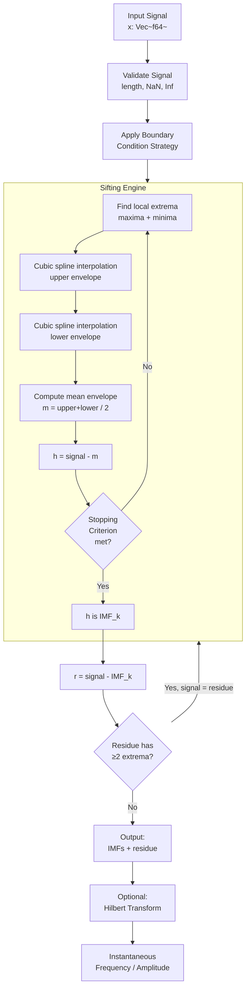
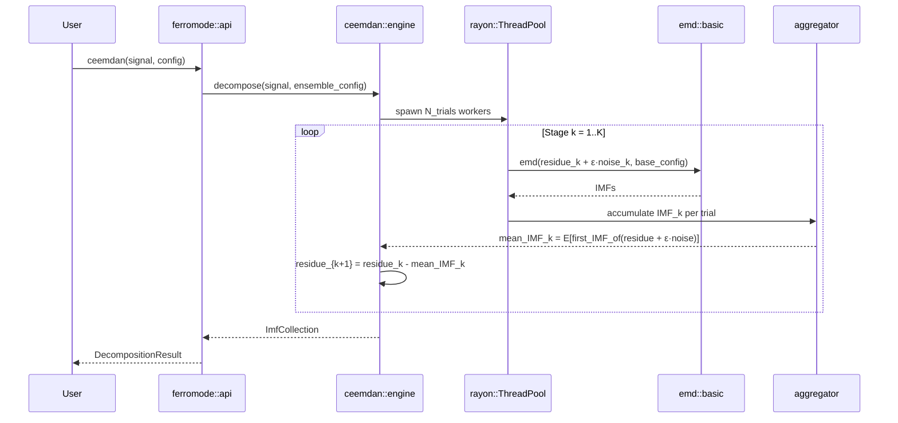
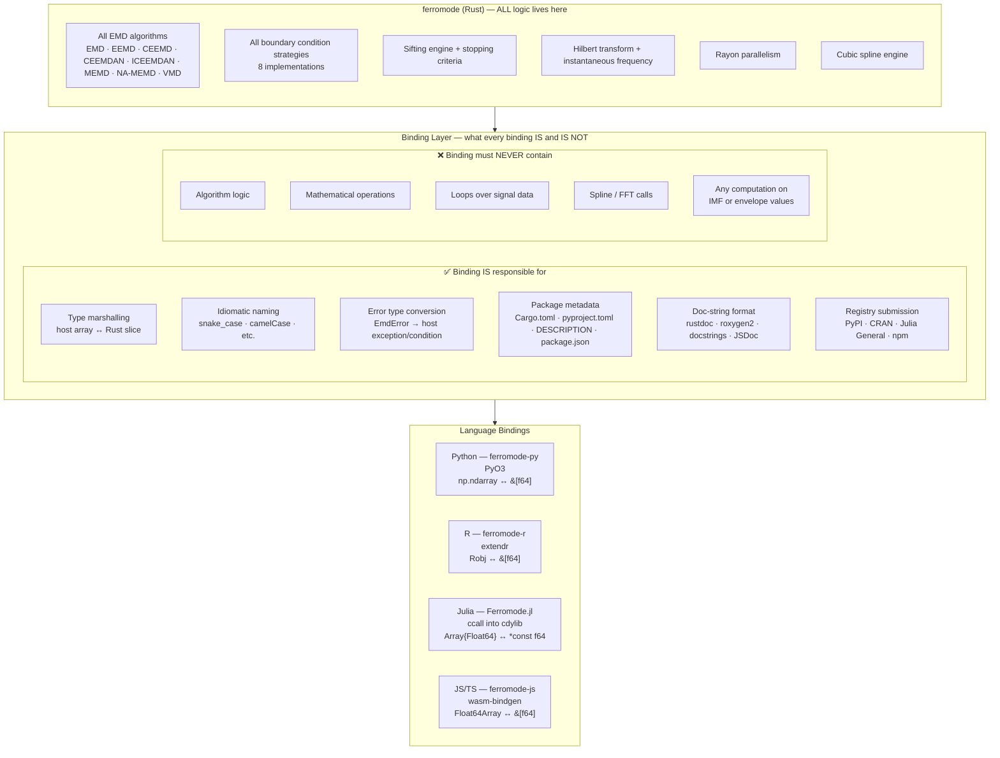
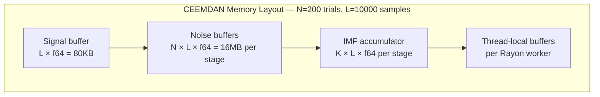

# Architecture Requirements Document (ARD)
## Ferromode: System Architecture

**Version:** 1.0  
**Date:** April 2026  
**Status:** Draft  

---

## 1. Architecture Overview

Ferromode follows a strict layered monorepo architecture with a single Rust core and language-specific binding crates built on top.

**Binding contract:** Language bindings contain **zero algorithmic logic**. Every algorithm, every boundary condition strategy, every sifting criterion, every post-processing computation lives exclusively in `ferromode`. Bindings are responsible for exactly three things and nothing else:

1. **Type marshalling** — convert the host language's native array/number types into the form the Rust FFI expects, and convert results back
2. **Idiomatic API surface** — expose functions and types that feel natural in the target language (naming conventions, error handling idioms, documentation format)
3. **Packaging & distribution** — build configuration, package metadata, registry submission

If you find yourself writing a for-loop or a mathematical expression in a binding, it belongs in `ferromode` instead.



---

## 2. Repository Structure

```
ferromode/                         # Monorepo root
├── Cargo.toml                     # Workspace manifest
│
├── crates/
│   │
│   ├── ferromode/                # ★ Core Rust library — ALL logic lives here
│   │   ├── src/
│   │   │   ├── lib.rs
│   │   │   ├── api.rs             # Public Rust API (used by PyO3 / extendr / WASM)
│   │   │   ├── ffi.rs             # C-ABI exports (used by Julia ccall)
│   │   │   ├── algorithms/
│   │   │   │   ├── mod.rs
│   │   │   │   ├── emd.rs
│   │   │   │   ├── eemd.rs
│   │   │   │   ├── ceemd.rs
│   │   │   │   ├── ceemdan.rs
│   │   │   │   ├── iceemdan.rs
│   │   │   │   ├── memd.rs
│   │   │   │   ├── namemd.rs
│   │   │   │   └── vmd.rs
│   │   │   ├── boundary/
│   │   │   │   ├── mod.rs
│   │   │   │   ├── characteristic_wave.rs
│   │   │   │   ├── mirror.rs
│   │   │   │   ├── periodic.rs    # Zeng & He 2004
│   │   │   │   ├── slope.rs
│   │   │   │   ├── ar_model.rs
│   │   │   │   ├── svr.rs
│   │   │   │   ├── waveform_match.rs
│   │   │   │   └── none.rs
│   │   │   ├── sifting/
│   │   │   │   ├── engine.rs
│   │   │   │   └── criteria.rs
│   │   │   ├── spline/
│   │   │   │   └── cubic.rs
│   │   │   ├── hilbert/
│   │   │   │   ├── transform.rs
│   │   │   │   └── instantaneous.rs
│   │   │   ├── parallel/
│   │   │   │   └── pool.rs
│   │   │   ├── types.rs
│   │   │   └── error.rs
│   │   └── tests/
│   │       ├── reference_signals.rs
│   │       ├── boundary_tests.rs
│   │       └── algorithm_tests.rs
│   │
│   ├── emd-python/                # ★ Python binding — marshalling only
│   │   ├── src/
│   │   │   └── lib.rs             # #[pymodule] + #[pyfunction] wrappers
│   │   │                          #   — converts np.ndarray → &[f64], calls ferromode::api
│   │   │                          #   — converts results → PyObject
│   │   │                          #   — releases GIL for ensemble methods
│   │   │                          #   — NO algorithms, NO math, NO loops over data
│   │   ├── pyproject.toml
│   │   ├── python/
│   │   │   └── ferromode_py/
│   │   │       ├── __init__.py    # re-exports + type stubs only
│   │   │       └── py.typed       # PEP 561 marker
│   │   └── tests/
│   │       └── test_binding.py    # smoke tests: call → correct shape/type returned
│   │
│   ├── emd-r/                     # ★ R binding — marshalling only
│   │   ├── src/
│   │   │   └── lib.rs             # #[extendr] wrappers
│   │   │                          #   — Robj::as_real_slice() → &[f64], calls ferromode::api
│   │   │                          #   — results → named R list with S3 class
│   │   │                          #   — NO algorithms, NO math, NO R computation
│   │   ├── R/
│   │   │   └── ferromode-r-extendr-wrappers.R  # auto-generated by extendr; do not edit
│   │   ├── DESCRIPTION
│   │   ├── NAMESPACE
│   │   └── tests/
│   │       └── testthat/
│   │           └── test-binding.R  # smoke tests only
│   │
│   ├── emd-julia/                 # ★ Julia binding — marshalling only
│   │   ├── src/
│   │   │   └── lib.rs             # cdylib crate — C ABI re-exports from emd_core::ffi
│   │   │                          #   — no logic added here; purely re-exports
│   │   ├── include/
│   │   │   └── ferromode.h         # C header generated by cbindgen
│   │   └── julia/
│   │       └── Ferromode.jl/
│   │           ├── src/
│   │           │   └── Ferromode.jl # ccall wrappers + Julia struct definitions
│   │           │                  #   — marshals Array{Float64} ↔ Ptr{Float64}
│   │           │                  #   — wraps result pointers in Julia structs
│   │           │                  #   — registers finalizers calling emd_free()
│   │           │                  #   — NO algorithms, NO math
│   │           └── test/
│   │               └── runtests.jl
│   │
│   └── emd-wasm/                  # ★ JS/TS binding — marshalling only
│       ├── src/
│       │   └── lib.rs             # #[wasm_bindgen] wrappers
│       │                          #   — copies Float64Array into WASM memory
│       │                          #   — calls ferromode::api
│       │                          #   — exposes result accessors (get_imf, get_residue)
│       │                          #   — NO algorithms, NO math
│       ├── pkg/                   # wasm-pack output (gitignored)
│       └── tests/
│           └── web.rs
│
│   ├── ferromode-mex/             # ★ MATLAB/Octave binding — marshalling only
│   │   ├── src/
│   │   │   └── lib.rs             # cdylib; extern "C" mexFunction entry point
│   │   │                          #   — mxGetPr() + mxGetM() → &[f64], calls ferromode::ffi
│   │   │                          #   — results → mxCreateDoubleMatrix / mxCreateStructMatrix
│   │   │                          #   — NO algorithms, NO math
│   │   ├── build.rs               # links libmex+libmx (MATLAB) or liboctave (Octave)
│   │   ├── matlab/
│   │   │   └── *.m                # named-argument sugar wrappers; zero computation
│   │   └── tests/
│   │       └── test_ferromode.m   # smoke tests: assert struct fields + sizes only
│   │
│   └── ferromode-cxx/             # ★ C++ binding — header-only wrapper + cxx bridge
│       ├── include/
│       │   └── ferromode.hpp      # C++17 header-only RAII wrapper over ferromode.h
│       │                          #   — ImfCollection RAII, std::span inputs, all 8 algos
│       │                          #   — NO algorithms, NO math
│       ├── src/
│       │   └── lib.rs             # Optional: cxx bridge crate for Cargo-integrated projects
│       ├── CMakeLists.txt         # FetchContent target: ferromode::ferromode
│       ├── ferromode.pc           # pkg-config file for non-CMake build systems
│       └── tests/
│           └── test_ferromode.cpp # Catch2 smoke tests: sizes + types only
│
├── docs/
│   ├── PRD.md
│   ├── ARD.md
│   ├── algorithms/                # Mathematical documentation per algorithm
│   ├── binding-guide.md           # How to write a compliant binding (the contract)
│   └── api/                       # Generated: cargo doc + wasm-pack doc
│
├── validation/
│   ├── cross_language/            # Runs identical decomposition in all 6 bindings
│   └── reference/                 # Reference JSON outputs from Rilling-Flandrin C code
│
└── .github/
    └── workflows/
        ├── ci.yml                 # Rust tests + clippy + fmt
        ├── bindings.yml           # Build + test all 6 bindings
        ├── release.yml            # Publish to crates.io / PyPI / CRAN / Julia / npm / vcpkg
        ├── matlab.yml             # Nightly: build + test MEX (requires MATLAB licence or Octave)
        └── cross_lang_validate.yml
```

---

## 3. Core Data Model



---

## 4. Algorithm Architecture



---

## 5. Ensemble Method Architecture (CEEMDAN Example)



---

## 6. Boundary Condition Architecture

```mermaid
flowchart LR
    subgraph INPUT
        SIG[Original Signal\n[x₀, x₁, ... xₙ]]
    end

    subgraph STRATEGIES[Boundary Strategy]
        CW[CharacteristicWave\nAppend 4 synthetic waves\nper end based on\nnearest 2 extrema]
        MIR[Mirror\nEven-reflect about\nboth endpoints]
        PER[Periodic / Zeng-He\nEven + odd extension,\nperiodic spline BC]
        SLP[Slope\nLinear extrapolation\nfrom endpoint gradient]
        AR[AR Model\nFit AR(p) to interior,\nforecast/backcast]
        WM[WaveformMatch\nCross-correlate end\nregion with interior]
    end

    subgraph OUTPUT
        EXT[Extended Signal\n[x_ext ... x₀ ... xₙ ... x_ext]]
        EXT2[Envelope computed\non extended signal]
        EXT3[Trim to original\nlength after sifting]
    end

    SIG --> CW & MIR & PER & SLP & AR & WM
    CW & MIR & PER & SLP & AR & WM --> EXT
    EXT --> EXT2 --> EXT3
```

---

## 7. Language Binding Architecture

### The Pure-Wrap Contract

All bindings conform to a strict interface contract. The diagram below shows what is **in scope** vs **out of scope** for any binding crate.



### Per-Binding Technical Approach

```mermaid
flowchart LR
    subgraph PY_DETAIL["Python (PyO3)"]
        direction TB
        PY1["emd-python crate\n#[pymodule] entry point"]
        PY2["#[pyfunction] wrappers\ncall ferromode::api directly"]
        PY3["PyReadonlyArray1 → &[f64]\nno copy if C-contiguous"]
        PY4["ImfCollection → PyObject\n.imfs as np.ndarray\n.residue as np.ndarray"]
        PY5["py.allow_threads()\nfor ensemble methods\n(releases Python GIL)"]
        PY1 --> PY2 --> PY3 --> PY4 --> PY5
    end

    subgraph R_DETAIL["R (extendr)"]
        direction TB
        R1["emd-r crate\n#[extendr] attribute macros"]
        R2["Robj as_real_slice()\n→ &[f64] zero-copy"]
        R3["Results returned as\nnamed R list\n(S3 class emd_result)"]
        R4["No R computation;\nall formatting in Rust\nor trivial R glue"]
        R1 --> R2 --> R3 --> R4
    end

    subgraph JL_DETAIL["Julia (ccall)"]
        direction TB
        JL1["ferromode compiled as\ncdylib (.so / .dylib / .dll)"]
        JL2["Stable C ABI header\nferromode.h"]
        JL3["Julia ccall with\nPtr{Float64} / Csize_t"]
        JL4["Julia structs mirror\nC structs exactly"]
        JL5["Ownership: Rust allocates,\njulia_free() releases via FFI"]
        JL1 --> JL2 --> JL3 --> JL4 --> JL5
    end

    subgraph JS_DETAIL["JavaScript/TypeScript (wasm-bindgen)"]
        direction TB
        JS1["emd-wasm crate\n#[wasm_bindgen] exports"]
        JS2["Float64Array view\ninto WASM linear memory"]
        JS3["Results as WASM structs\nwith get_imf(n: usize)\nget_residue() accessors"]
        JS4["wasm-pack build\n--target web + --target nodejs"]
        JS5[".d.ts auto-generated\nby wasm-bindgen"]
        JS1 --> JS2 --> JS3 --> JS4 --> JS5
    end

    subgraph MEX_DETAIL["MATLAB/Octave (MEX)"]
        direction TB
        MEX1["ferromode-mex crate\ncdylib with mexFunction extern C"]
        MEX2["mxGetPr() + mxGetNumberOfElements()\n→ *const f64 + len → &[f64]"]
        MEX3["Calls ferromode::ffi directly\n(reuses Julia C-ABI cdylib)"]
        MEX4["Results → mxCreateStructMatrix\nwith mxCreateDoubleMatrix fields"]
        MEX5[".m wrapper files provide\nnamed-arg sugar only (no computation)"]
        MEX1 --> MEX2 --> MEX3 --> MEX4 --> MEX5
    end

    subgraph CPP_DETAIL["C++ (header-only + cxx bridge)"]
        direction TB
        CPP1["ferromode.hpp C++17 header\nRAII ImfCollection wrapper"]
        CPP2["std::span<const double>.data() + .size()\n→ *const f64 + len → ferromode.h FFI"]
        CPP3["Calls ferromode_emd() etc.\nfrom C-ABI (same as Julia layer)"]
        CPP4["ImfCollection destructor\ncalls ferromode_free_result()"]
        CPP5["Optional cxx bridge\nfor Cargo-integrated projects"]
        CPP1 --> CPP2 --> CPP3 --> CPP4 --> CPP5
    end
```



### Memory Ownership Rules

| Binding | Array In | Array Out | Ownership |
|---------|----------|-----------|-----------|
| Python (PyO3) | `PyReadonlyArray1<f64>` — zero-copy borrow of NumPy buffer | `PyArray1<f64>` — new allocation, owned by Python GC | Python owns output; Rust borrows input |
| R (extendr) | `as_real_slice()` — zero-copy borrow of R SEXP | `Vec<f64>` serialised into R SEXP | R owns all objects |
| Julia (ccall) | Raw `*const f64` + length — caller (Julia) owns | Rust allocates result; caller must call `ferromode_free_result()` | Explicit transfer; Julia `finalizer` calls free |
| JS (WASM) | `Float64Array` copied into WASM linear memory on call | Indices into WASM memory; JS calls `.free()` when done | WASM linear memory; explicit free required |
| MATLAB (MEX) | `mxGetPr()` borrow — MATLAB owns input `mxArray` | `mxCreateDoubleMatrix` allocated by MEX; MATLAB engine owns output | MATLAB owns all arrays; no manual free |
| C++ (header) | `std::span<const double>` — caller owns, no copy | `ImfCollection` RAII — destructor calls `ferromode_free_result()` | RAII; C++ stack unwind handles cleanup |

---

## 8. CI/CD Pipeline

```mermaid
flowchart LR
    PR[Pull Request] --> LINT[Cargo clippy\n+ rustfmt]
    LINT --> UNIT[Rust unit tests\ncargo test]
    UNIT --> INTEGRATION[Integration tests\nreference signals]
    INTEGRATION --> CROSS[Cross-language\nvalidation suite\nRust+Py+R+Julia+JS+C++]
    CROSS --> BUILD_BINDINGS

    subgraph BUILD_BINDINGS[Build All Bindings — on every PR]
        BP[Build Python\nmaturin build]
        BR[Build R\ncargo build + R CMD check]
        BJ[Build Julia\nJulia package tests]
        BJS[Build WASM\nwasm-pack build]
        BCPP[Build C++\nCMake + Catch2\nGCC + Clang + MSVC]
    end

    subgraph NIGHTLY[Nightly only — requires licence]
        BMAT[Build MATLAB MEX\nOctave fallback in open CI]
    end

    BUILD_BINDINGS --> BENCH[Benchmarks\ncriterion.rs]
    BENCH --> DOCS[Build docs\ncargo doc + mkdocs]
    DOCS --> RELEASE{Release\ntag?}
    RELEASE -- Yes --> PUBLISH[Publish to\ncrates.io / PyPI / CRAN /\nJulia General / npm /\nvcpkg / Conan /\nMATLAB Add-On Explorer]
    RELEASE -- No --> DONE[✓ CI Pass]
```



---

## 9. Performance Architecture

### Parallelism Strategy

| Component | Parallelism Approach | Notes |
|-----------|---------------------|-------|
| Basic EMD | Single-threaded | Inherently sequential |
| EEMD/CEEMD | Data-parallel over trials | Each trial independent — ideal for Rayon `par_iter` |
| CEEMDAN | Stage-parallel within each stage | Trials at each IMF stage parallelized |
| MEMD | Parallel over direction projections | N direction computations per sifting step |
| Spline fitting | Single-threaded per envelope | Could batch if many short signals |

### Memory Model



### Benchmarking Targets

| Signal Length | Algorithm | Threads | Target |
|--------------|-----------|---------|--------|
| 1,000 | EMD | 1 | < 5ms |
| 10,000 | EMD | 1 | < 50ms |
| 100,000 | EMD | 1 | < 500ms |
| 10,000 | CEEMDAN (200 trials) | 8 | < 10s |
| 10,000 | MEMD (4 channels) | 4 | < 2s |

---

## 10. Security & Reliability

- All array accesses bounds-checked in debug builds; release builds use `get_unchecked` only in proven hot paths with safety comments
- No `unsafe` code except in FFI boundary and proven performance-critical spline inner loops
- All `unsafe` blocks require `SAFETY:` doc comment
- Inputs validated at API boundary (NaN, Inf, zero-length rejected with typed errors)
- Seeded RNG (rand::SeedableRng) for reproducible ensemble methods
- Panic-free public API: all errors returned as `Result<T, EmdError>`
