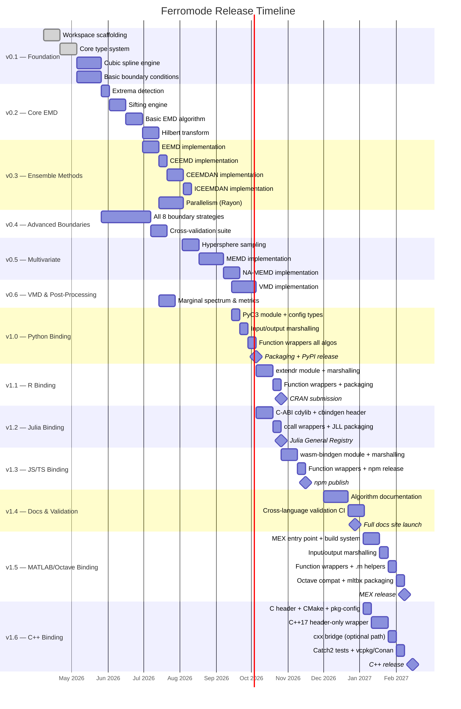
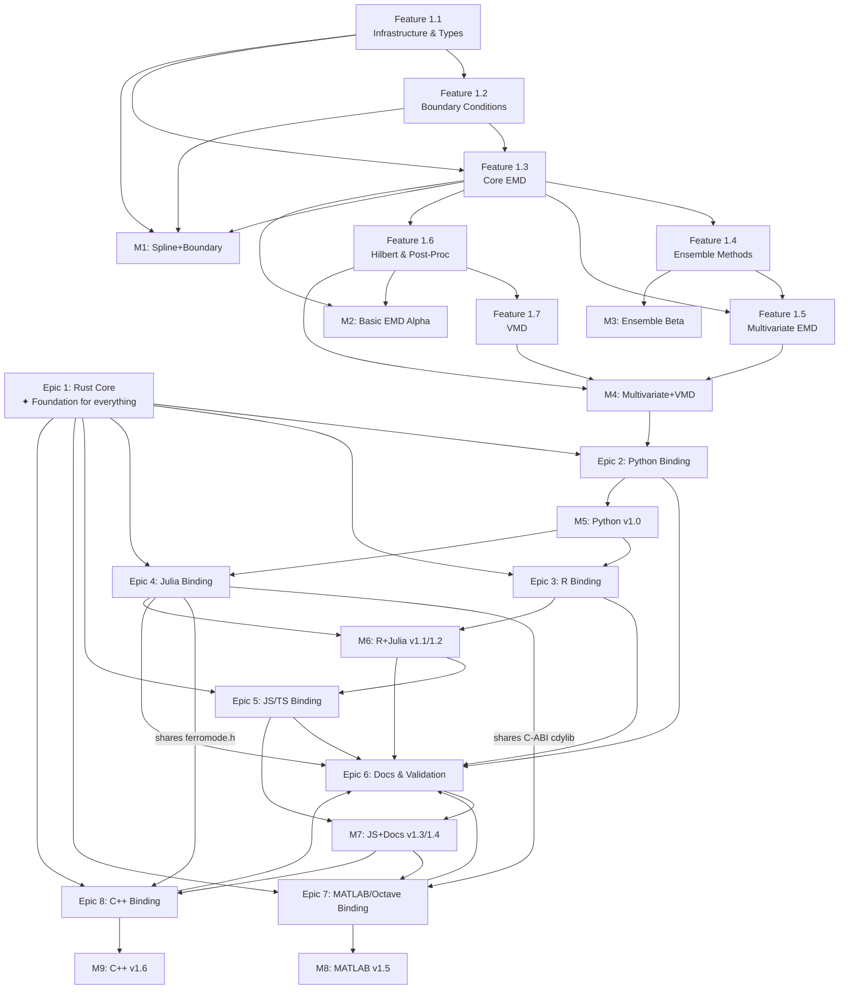
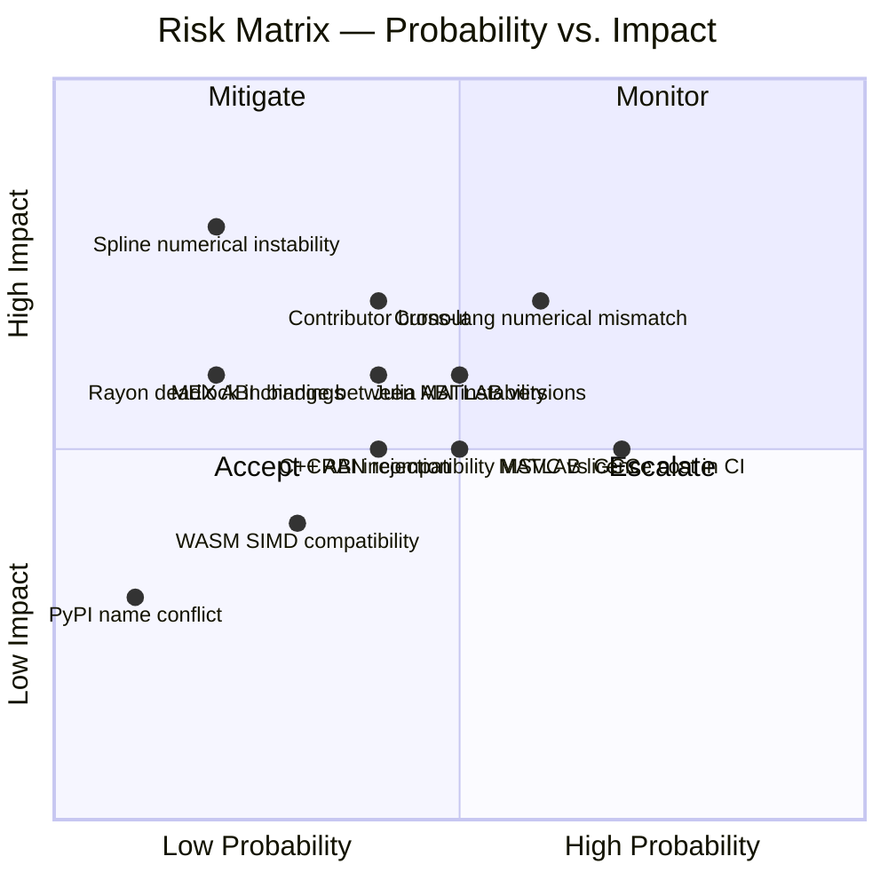

# Release, Milestone & Epic Matrix
## Ferromode Project

---

## Release Overview

---

## Release × Epic × Feature Matrix

| Epic | v0.x Foundation | v1.0 Python | v1.1–1.2 R+Julia | v1.3–1.4 JS+Docs | v1.5 MATLAB | v1.6 C++ |
|------|:--------------:|:-----------:|:----------------:|:----------------:|:-----------:|:--------:|
| **Epic 1: Rust Core** | ✅ F1.1–1.7 | — | — | — | — | — |
| **Epic 2: Python** | — | ✅ F2.1 | — | — | — | — |
| **Epic 3: R** | — | — | ✅ F3.1 | — | — | — |
| **Epic 4: Julia** | — | — | ✅ F4.1 | — | — | — |
| **Epic 5: JS/TS** | — | — | — | ✅ F5.1 | — | — |
| **Epic 6: Docs/Val** | 🔄 Partial | 🔄 Partial | 🔄 Ongoing | ✅ F6.1–6.2 | 🔄 Update | 🔄 Update |
| **Epic 7: MATLAB** | — | — | — | — | ✅ F7.1 | — |
| **Epic 8: C++** | — | — | — | — | — | ✅ F8.1 |

---

## Detailed Milestone Breakdown

### Milestone M0: Project Bootstrap
**Target:** Week 2 of April 2026  
**Exit Criteria:** Workspace builds, CI green, contributing guide published

| Epic | Feature | Stories | Tasks | Status |
|------|---------|---------|-------|--------|
| Epic 1 | F1.1 Core Infrastructure | S1.1.1 Scaffolding | T-001 to T-007 | 🔲 |

---

### Milestone M1: Spline & Boundary Foundation  
**Target:** End of May 2026  
**Exit Criteria:** All 8 boundary strategies implemented and tested; cubic spline matches scipy within 1e-10

| Epic | Feature | Stories | Tasks | Status |
|------|---------|---------|-------|--------|
| Epic 1 | F1.1 Types | S1.1.2, S1.1.3, S1.1.4 | T-008 to T-025 | 🔲 |
| Epic 1 | F1.2 Boundaries | S1.2.1 to S1.2.7 | T-026 to T-049 | 🔲 |

---

### Milestone M2: Basic EMD Alpha
**Target:** End of June 2026  
**Release Tag:** `v0.2.0-alpha`  
**Exit Criteria:** Basic EMD produces correct IMFs on reference signals; reconstruction error < 1e-12; published to crates.io as pre-release

| Epic | Feature | Stories | Tasks | Status |
|------|---------|---------|-------|--------|
| Epic 1 | F1.3 Core EMD | S1.3.1, S1.3.2, S1.3.3 | T-050 to T-066 | 🔲 |
| Epic 1 | F1.6 Hilbert | S1.6.1 | T-097 to T-102 | 🔲 |

---

### Milestone M3: Ensemble Methods Beta
**Target:** End of July 2026  
**Release Tag:** `v0.3.0-beta`  
**Exit Criteria:** EEMD, CEEMD, CEEMDAN, ICEEMDAN all implemented; parallel execution verified; CEEMDAN 200 trials on 10K samples < 10s on 8 cores

| Epic | Feature | Stories | Tasks | Status |
|------|---------|---------|-------|--------|
| Epic 1 | F1.4 Ensemble | S1.4.1 to S1.4.4 | T-067 to T-083 | 🔲 |

---

### Milestone M4: Multivariate & VMD
**Target:** End of September 2026  
**Release Tag:** `v0.5.0`  
**Exit Criteria:** MEMD, NA-MEMD, VMD implemented; mode-alignment test passes; all post-processing metrics available

| Epic | Feature | Stories | Tasks | Status |
|------|---------|---------|-------|--------|
| Epic 1 | F1.5 MEMD | S1.5.1 to S1.5.3 | T-084 to T-096 | 🔲 |
| Epic 1 | F1.6 Post-Proc | S1.6.2 | T-103 to T-106 | 🔲 |
| Epic 1 | F1.7 VMD | S1.7.1 | T-107 to T-112 | 🔲 |

---

### Milestone M5: Python v1.0
**Target:** Early October 2026  
**Release Tag:** `v1.0.0`  
**Exit Criteria:** Published to PyPI; all 8 algorithms callable; inputs/outputs are numpy arrays; EmdError maps to Python ValueError; GIL released during ensemble methods; binding smoke-tests pass; cross-language validation confirms numerical identity with Rust core

| Epic | Feature | Stories | Tasks | Status |
|------|---------|---------|-------|--------|
| Epic 2 | F2.1 Python | S2.1.1 to S2.1.5 | T-113 to T-133 | 🔲 |
| Epic 6 | F6.1 Validation | S6.1.1, S6.1.2 | T-184 to T-189 | 🔲 |

---

### Milestone M6: R + Julia v1.1 / v1.2
**Target:** Late October 2026  
**Release Tags:** `v1.1.0` (R), `v1.2.0` (Julia)  
**Exit Criteria:** R package passes CRAN checks; Julia package registered in General Registry; both bindings expose all 8 algorithms as pure marshalling wrappers; smoke-tests verify correct types and shapes; cross-language validation confirms numerical identity with Rust core

| Epic | Feature | Stories | Tasks | Status |
|------|---------|---------|-------|--------|
| Epic 3 | F3.1 R | S3.1.1 to S3.1.5 | T-134 to T-148 | 🔲 |
| Epic 4 | F4.1 Julia | S4.1.1 to S4.1.4 | T-149 to T-164 | 🔲 |

---

### Milestone M7: JS/TS + Full Docs v1.3 / v1.4
**Target:** Mid-November 2026  
**Release Tags:** `v1.3.0` (JS/TS), `v1.4.0` (docs/validation complete)  
**Exit Criteria:** npm package published; WASM module works in browser and Node.js; all 8 algorithms callable via Float64Array; TypeScript .d.ts auto-generated; `binding-guide.md` documenting the pure-wrap contract is live; cross-language validation CI covers all 6 bindings

| Epic | Feature | Stories | Tasks | Status |
|------|---------|---------|-------|--------|
| Epic 5 | F5.1 JS/TS | S5.1.1 to S5.1.5 | T-165 to T-183 | 🔲 |
| Epic 6 | F6.2 Docs | S6.2.1, S6.2.2 | T-190 to T-197 | 🔲 |

---

### Milestone M8: MATLAB/Octave v1.5
**Target:** Early February 2027  
**Release Tag:** `v1.5.0`  
**Exit Criteria:** MEX binaries published for Linux/macOS/Windows; all 8 algorithms callable from MATLAB and GNU Octave; `.mltbx` submitted to MATLAB Add-On Explorer; Octave package submitted to Octave Forge; CI builds MEX on GitHub Actions using Octave as the open licence alternative; cross-language validation extended to include MATLAB leg

| Epic | Feature | Stories | Tasks | Status |
|------|---------|---------|-------|--------|
| Epic 7 | F7.1 MEX Layer | S7.1.1 to S7.1.5 | T-198 to T-218 | 🔲 |

---

### Milestone M9: C++ v1.6
**Target:** Mid-February 2027  
**Release Tag:** `v1.6.0`  
**Exit Criteria:** `ferromode.hpp` header-only wrapper published; CMake `FetchContent` integration works; `cxx` bridge crate published; `vcpkg` and Conan packages submitted; builds clean under GCC 12+, Clang 15+, MSVC 2022 with ASan/UBSan; cross-language validation extended to include C++ leg

| Epic | Feature | Stories | Tasks | Status |
|------|---------|---------|-------|--------|
| Epic 8 | F8.1 C++ Layer | S8.1.1 to S8.1.4 | T-219 to T-237 | 🔲 |

---

## Dependency Graph Between Epics

---

## Task Count Summary

| Epic | Features | Stories | Tasks | Est. Weeks |
|------|----------|---------|-------|-----------|
| Epic 1: Rust Core | 7 | 21 | 112 | 22 |
| Epic 2: Python (PyO3) | 1 | 5 | 21 | 3 |
| Epic 3: R (extendr) | 1 | 5 | 15 | 3 |
| Epic 4: Julia (ccall) | 1 | 4 | 16 | 3 |
| Epic 5: JS/TS (WASM) | 1 | 5 | 19 | 3 |
| Epic 6: Docs/Validation | 2 | 4 | 14 | 6 |
| Epic 7: MATLAB/Octave (MEX) | 1 | 5 | 21 | 4 |
| Epic 8: C++ (cxx bridge) | 1 | 4 | 19 | 4 |
| **TOTAL** | **15** | **53** | **237** | **~48** |

---

## Risk Register

| Risk | Probability | Impact | Mitigation |
|------|-------------|--------|------------|
| Cross-language numerical mismatch | High | High | Rust is ground truth; CI cross-validation on every PR across all 6 bindings |
| Julia ABI instability (ccall) | Medium | High | Pin Julia version; consider CxxWrap as alternative |
| Spline numerical instability at boundaries | Low | High | Thorough unit tests; fallback to natural spline if periodic fails |
| CRAN rejection | Medium | Medium | Follow CRAN policy checklist from day 1; submit early for review |
| Rayon deadlock in Python GIL context | Low | High | Release GIL explicitly via PyO3 `py.allow_threads()`; test thoroughly |
| MATLAB licence cost in CI | High | Medium | Use GNU Octave (free, MEX-compatible) for open CI; MATLAB CI on nightly with org licence |
| MEX ABI change between MATLAB versions | Medium | Medium | Test against MATLAB R2022b, R2024a, R2025a; pin MEX SDK version in build |
| C++ ABI incompatibility MSVC vs GCC/Clang | Medium | Medium | Use C ABI (not C++ ABI) at the FFI boundary; test all three toolchains in CI |
| Contributor burnout (solo project) | Medium | High | Modular design; clear contribution guide; community engagement from v0.2 |
