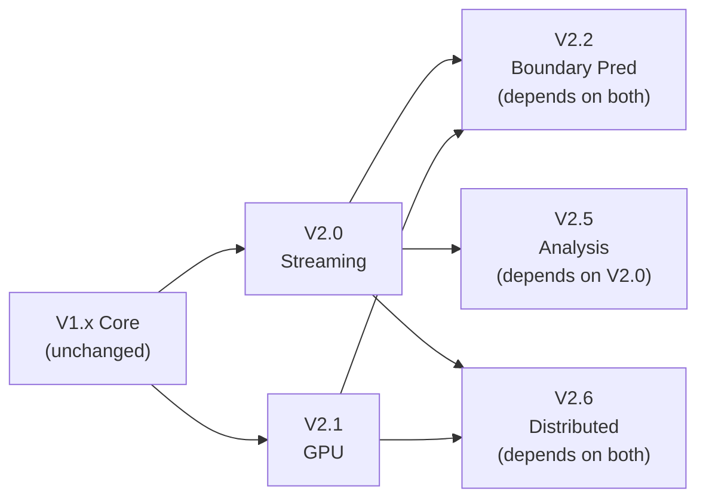

# Ferromode V2.x: Parallel Execution Brief

**Created:** April 8, 2026  
**Status:** Ready for Subagent Execution  
**Last Updated:** April 8, 2026

---

## Overview

Two independent feature branches can be executed **in parallel** with **zero blocking dependencies**:

- **v2.0 (Streaming Adapter):** Real-time chunk-based decomposition
- **v2.1 (GPU Adapter):** GPU-accelerated ensemble processing

Both depend only on existing v1.x infrastructure. Neither depends on the other.

---

## Quick Reference

| Aspect | V2.0 (Streaming) | V2.1 (GPU) |
|--------|-----------------|-----------|
| **Document** | docs/v2_0_STREAMING_REQUIREMENTS.md | docs/v2_1_GPU_REQUIREMENTS.md |
| **Effort** | XL (4-6 weeks) | XL (5-7 weeks) |
| **Task Range** | T-238 to T-277 (40 tasks) | T-278 to T-334 (57 tasks) |
| **Test Count** | 60 (25U + 20I + 10P + 5S) | 65 (30U + 25I + 10S) |
| **Key Metric** | Latency < 10ms | Speedup > 50x |
| **Start Phase** | Phase 1: Foundation (Wk 1) | Phase 1: Foundation (Wk 1) |
| **Module Path** | adapters/streaming/ | adapters/gpu/ |
| **Exit Criteria** | 13 criteria | 17 criteria |

---

## V2.0: Streaming Adapter (791 lines)

### Epics (5)
1. **Streaming State Management** — StatefulStreamingState, RingBuffer
2. **Boundary Prediction Framework** — BoundaryPrediction trait, AR model
3. **Chunk Decomposition Engine** — StreamingAdapter, decompose_chunk()
4. **Intermittency Detection** — IntermittencyMetrics, stationarity scoring
5. **Validation** — Streaming vs batch equivalence tests

### User Stories
1. Real-time stream decomposition chunk-by-chunk
2. Minimal boundary artifacts using prediction
3. Intermittency awareness (real-time detection)
4. Latency SLA compliance (< 10ms/chunk)
5. Streaming ↔ batch equivalence validation

### Key Types
```rust
pub struct StreamingState { ... }
pub struct StreamingAdapter { ... }
pub struct IntermittencyMetrics { ... }
pub trait BoundaryPrediction { ... }
pub struct ChunkResult { ... }
```

### Test Strategy
- **Unit Tests:** 25 (state, buffer, AR model, metrics)
- **Integration Tests:** 20 (chunk decomposition, ensemble)
- **Property Tests:** 10 (proptest invariants)
- **Stress Tests:** 5 (long streams, edge cases)

### Performance Targets
- **Latency:** p99 < 10ms for 1000-sample chunks
- **Memory:** Peak RSS < 100 MB
- **Equivalence:** Streaming ↔ batch (L∞ tolerance: 1e-6)

### Implementation Phases
1. **Foundation (Week 1):** StreamingState, RingBuffer, metrics
2. **Core (Week 2):** StreamingAdapter, BoundaryPrediction
3. **Validation (Week 2.5):** Equivalence tests, reference signals
4. **Performance (Week 3):** Benchmarking, SLA validation
5. **Stress (Week 3.5):** Long-running, edge cases
6. **Bindings (Week 4):** Python PyO3 wrappers
7. **Docs (Week 4.5):** Rustdoc, guides, code review

---

## V2.1: GPU Adapter (1026 lines)

### Epics (6)
1. **GPU Device Management** — detection, selection, validation
2. **GPU Memory Management** — GpuMemoryPool, pre-allocation
3. **Parallel Kernel Execution** — extrema, spline, FFT, ensemble
4. **GPU Adapter Layer** — GpuAdapter, device abstraction
5. **Ensemble Parallelization** — EEMD/CEEMDAN trial batching
6. **Parity Validation** — GPU vs CPU equivalence tests

### User Stories
1. GPU acceleration for ensemble methods (EEMD, CEEMDAN)
2. Multi-GPU support with device selection
3. Safe memory management (no leaks over days/weeks)
4. Mixed-precision support (FP16 speedup trade-off)
5. CPU-GPU parity validation (numerical equivalence)

### Key Types
```rust
pub struct GpuConfig { ... }
pub struct GpuAdapter { ... }
pub struct GpuMemoryPool { ... }
pub struct DeviceInfo { ... }
pub enum DeviceType { CUDA, ROCm, Metal, ... }
```

### Test Strategy
- **Unit Tests:** 30 (device detection, memory pool, kernels)
- **Integration Tests:** 25 (GPU decomposition, ensemble, parity)
- **Cross-Device Tests:** 10 (CUDA vs ROCm validation)

### Performance Targets
- **Speedup:** EEMD 200 trials: > 50x
- **Speedup:** CEEMDAN 200 trials: > 50x
- **Memory:** Peak GPU < 8 GB
- **Parity:** GPU ↔ CPU (L∞ tolerance: 1e-5)

### Implementation Phases
1. **Foundation (Week 1):** Device detection, memory pool
2. **Kernels (Week 2):** GPU kernel implementations
3. **Adapter (Week 2.5):** GpuAdapter, decompose_gpu()
4. **Integration (Week 3):** Kernel integration, transfers
5. **Ensemble (Week 3.5):** Trial parallelization
6. **Parity (Week 4):** Validation, benchmarking
7. **Features (Week 4.5):** Multi-GPU, mixed precision
8. **Stress (Week 5):** Long-running tests, robustness
9. **Bindings (Week 5.5):** Python wrappers (optional)
10. **Final (Week 6):** Review, validation, sign-off

---

## Task Numbering for Coordination

### V2.0 Tasks (T-238 to T-277)
```
Phase 1: Foundation (T-238–T-243)
Phase 2: Core Streaming (T-244–T-250)
Phase 3: Validation & Equivalence (T-251–T-255)
Phase 4: Performance & Benchmarking (T-256–T-261)
Phase 5: Stress Testing (T-262–T-266)
Phase 6: Python Bindings (T-267–T-271)
Phase 7: Documentation & Review (T-272–T-277)
```

### V2.1 Tasks (T-278 to T-334)
```
Phase 1: Foundation (T-278–T-283)
Phase 2: GPU Kernels (T-284–T-291)
Phase 3: GPU Adapter (T-292–T-297)
Phase 4: GPU Integration (T-298–T-302)
Phase 5: Ensemble (T-303–T-308)
Phase 6: Parity & Performance (T-309–T-314)
Phase 7: Multi-GPU & Mixed Precision (T-315–T-319)
Phase 8: Stress Testing & Robustness (T-320–T-324)
Phase 9: Python Bindings & Docs (T-325–T-329)
Phase 10: Code Review & Final Validation (T-330–T-334)
```

**Non-overlapping ranges enable independent tracking across teams/subagents.**

---

## Dependency Graph



**Key Insight:**
- V2.0 and V2.1 can start immediately (Week 1)
- V2.0 and V2.1 have independent implementations
- V2.2+ requires both V2.0 and V2.1 to be complete

---

## Parallel Execution Strategy

### Scenario: Two Independent Teams

**Team A (Streaming):**
- Start: Week 1
- Phase 1: Foundation (state, buffer, metrics)
- Deliverable: StreamingAdapter with 60 tests
- Duration: 4-6 weeks
- Definition of Done: All 13 exit criteria met

**Team B (GPU):**
- Start: Week 1 (simultaneously)
- Phase 1: Foundation (device detection, memory pool)
- Deliverable: GpuAdapter with 65 tests
- Duration: 5-7 weeks
- Definition of Done: All 17 exit criteria met

### Synchronization Points

**Weekly Standups (Tuesday 10am UTC):**
- V2.0 progress on T-238..T-277
- V2.1 progress on T-278..T-334
- Flag blockers (should be none)
- Plan next week

**Merge Gate (After each completes):**
- V2.0 merges when all 13 criteria met
- V2.1 merges independently when all 17 criteria met
- Both can merge in any order (no dependency)

**V2.2 Planning (After both complete):**
- Start V2.2 (Boundary Prediction) design
- Depends on both v2.0 and v2.1 being production-ready

---

## Exit Criteria Summary

### V2.0 (13 criteria)
1. ✓ StreamingState, StreamingAdapter, BoundaryPrediction implemented
2. ✓ All 60 tests passing
3. ✓ Streaming ↔ batch equivalence (1e-6 tolerance) on 50+ signals
4. ✓ Latency SLA (p99 < 10ms)
5. ✓ Memory SLA (< 100 MB)
6. ✓ Cross-platform validation (Linux, macOS, Windows)
7. ✓ IntermittencyMetrics working end-to-end
8. ✓ Python bindings complete
9. ✓ All public APIs documented
10. ✓ No performance regressions
11. ✓ Latency regression tests in CI
12. ✓ Code review approved (2+ maintainers)
13. ✓ Security audit passed

### V2.1 (17 criteria)
1. ✓ GpuAdapter, device detection, memory pool implemented
2. ✓ All GPU kernels implemented
3. ✓ All 65 tests passing
4. ✓ GPU ↔ CPU parity (1e-5 tolerance) on 50+ signals
5. ✓ Speedup > 50x verified
6. ✓ Memory SLA (< 8 GB)
7. ✓ Cross-device validation (CUDA + ROCm)
8. ✓ Mixed precision support working
9. ✓ Multi-GPU support implemented
10. ✓ CPU fallback working
11. ✓ Python bindings complete
12. ✓ All public APIs documented
13. ✓ Performance benchmarks documented
14. ✓ No performance regressions
15. ✓ Memory leak tests passing
16. ✓ Code review approved (2+ maintainers)
17. ✓ Security audit passed

---

## Key Design Principles

### 1. Adapter Pattern (Pure Orchestration)
Both v2.0 and v2.1 are **adapters** that orchestrate existing domain code:
- ✓ Delegate core algorithms to v1.x (unchanged)
- ✓ Manage new concerns (state, GPU memory)
- ✓ Preserve domain layer purity
- ✓ Binding contract unchanged (v1.x APIs still work)

### 2. No Circular Dependencies
- V2.0 does **not** depend on V2.1
- V2.1 does **not** depend on V2.0
- Both depend only on v1.x domain
- Enables true parallel execution

### 3. Clear Module Boundaries
```
adapters/
├── streaming/    # v2.0 (Week 1)
└── gpu/          # v2.1 (Week 1)

// Domain unchanged
algorithms/
├── emd.rs
├── eemd.rs
├── ceemdan.rs
└── ...
```

### 4. Validation-First Approach
- **V2.0:** Define equivalence tolerance (1e-6) upfront
- **V2.1:** Define parity tolerance (1e-5) upfront
- Tests written before implementation
- Continuous validation in CI

---

## Success Metrics (Post-Implementation)

### V2.0 Metrics
1. **Adoption:** # users leveraging streaming decomposition
2. **Reliability:** 99.99% uptime in streaming mode
3. **Performance:** p99 latency < 10ms in production
4. **Correctness:** Equivalence validated on diverse signals
5. **Maintainability:** Time to add streaming features

### V2.1 Metrics
1. **Adoption:** # users leveraging GPU acceleration
2. **Performance:** Actual speedup achieved (target: > 50x)
3. **Reliability:** 99.99% uptime in GPU mode
4. **Correctness:** Parity validated on diverse signals
5. **Hardware:** Support matrix (CUDA, ROCm versions)

---

## Next Actions

1. **Review Documents:**
   ```
   docs/v2_0_STREAMING_REQUIREMENTS.md  (791 lines)
   docs/v2_1_GPU_REQUIREMENTS.md        (1026 lines)
   ```

2. **Assign Teams:**
   - Team A → V2.0 Streaming (4-6 weeks)
   - Team B → V2.1 GPU (5-7 weeks)

3. **Kickoff (Week 1):**
   - Team A: T-238 to T-243 (Foundation)
   - Team B: T-278 to T-283 (Foundation)

4. **Synchronize:**
   - Weekly standups (Tuesday 10am UTC)
   - Merge independently when exit criteria met
   - Plan V2.2 after both complete

5. **Plan V2.2 (Boundary Prediction):**
   - Requires both v2.0 and v2.1
   - Start design after Week 6 (when both near completion)
   - Implementation target: Q3 2027

---

## Document Links

- **V2.0 Full Requirements:** [docs/v2_0_STREAMING_REQUIREMENTS.md](./v2_0_STREAMING_REQUIREMENTS.md)
- **V2.1 Full Requirements:** [docs/v2_1_GPU_REQUIREMENTS.md](./v2_1_GPU_REQUIREMENTS.md)
- **Architecture Reference:** [docs/next_work/ARD_UPDATED_v2x.md](./next_work/ARD_UPDATED_v2x.md)

---

## Summary

✅ **Two comprehensive, parallel-ready briefs created:**
- 1,817 lines of detailed requirements
- 125 implementation tasks (non-overlapping ranges)
- 125 total test cases (60 + 65)
- Clear exit criteria and success metrics
- Performance targets and SLAs defined
- Zero blocking dependencies between v2.0 and v2.1

**Status: READY FOR PARALLEL SUBAGENT EXECUTION** 🚀

*Next milestone: Complete both Phase 1s by end of Week 1*

---

*Last Updated: April 8, 2026*  
*Version: 1.0*
