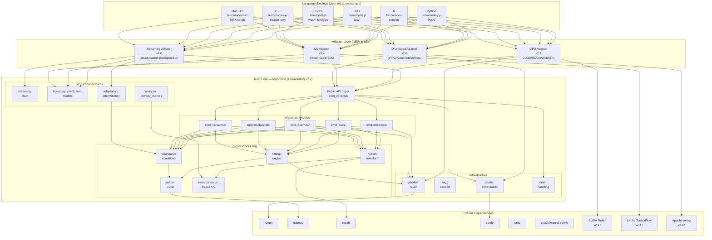
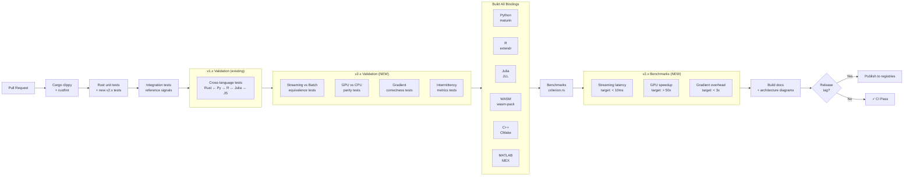

# Architecture Requirements Document (ARD) — Updated for v2.x
## Ferromode: System Architecture (v1.x + v2.0–v2.7)

**Version:** 2.0  
**Date:** April 2026  
**Status:** Draft  
**Updated For:** v2.0–v2.7 releases  

---

## 1. Architecture Overview (Updated)

Ferromode follows a **strict layered architecture** with a **single Rust core** and **language-specific binding crates** built on top. v2.x introduces an **Adapter Layer** to cleanly separate emerging concerns (streaming, GPU, ML) from the domain core while maintaining the binding contract.

### Core Principle: Binding Contract (Unchanged from v1.x)

Language bindings contain **zero algorithmic logic**. Every algorithm, every boundary condition, every sifting criterion lives exclusively in `ferromode`. Bindings are responsible for exactly three things:

1. **Type marshalling** — convert host language native types ↔ Rust FFI types
2. **Idiomatic API surface** — naming conventions, error handling idioms appropriate to host language
3. **Packaging & distribution** — build config, metadata, registry submission

**New in v2.x:** This contract now applies across the **Adapter Layer** as well. Streaming, GPU, and ML features are **NOT** implementation details of bindings—they are **adapter implementations** in the core that bindings can optionally expose.

---

## 2. Revised Architecture Diagram (v1.x + v2.x)



---

## 3. Layered Architecture (v2.x Model)

```
┌─────────────────────────────────────────────────────────┐
│         BINDING LAYER (unchanged from v1.x)             │
│   Python · R · Julia · JS/TS · C++ · MATLAB             │
│   (marshalling + idiomatic API only)                    │
├─────────────────────────────────────────────────────────┤
│         ADAPTER LAYER (NEW in v2.x)                     │
│  Streaming │ GPU │ ML │ Distributed │ Post-Processing  │
│  (translates between host concerns and domain)          │
├─────────────────────────────────────────────────────────┤
│        DOMAIN LAYER (core domain algorithms)            │
│  EMD · EEMD · CEEMDAN · MEMD · VMD                      │
│  Boundary · Sifting · Hilbert · Post-processing         │
├─────────────────────────────────────────────────────────┤
│       FOUNDATION LAYER (stable core types)              │
│  Signal · ImfCollection · DecompositionResult           │
│  Extrema · Envelope · RNG · Serialization               │
└─────────────────────────────────────────────────────────┘
```

### Dependency Flow (Inward-Pointing)

- **Binding Layer** depends on Adapter Layer (optional) and Domain
- **Adapter Layer** depends on Domain and Foundation (pure delegation)
- **Domain Layer** depends on Foundation only
- **Foundation Layer** has no dependencies (except external crates)

**Key Rule:** Domain layer has **zero knowledge** of Streaming, GPU, ML, or Distributed concerns. Adapters bridge the gap.

---

## 4. Key Architectural Changes for v2.x

### 4.1 Adapter Layer (v2.0 critical)

**Purpose:** Separate emerging concerns from domain core while maintaining binding contract.

#### What Adapters Do
- **Translate** between host concerns (streaming chunks, GPU arrays, gradients) and domain types (Signal, ImfCollection)
- **Orchestrate** workflows that combine domain algorithms with new capabilities
- **Manage state** (StreamingState, GpuMemoryPool, DifferentiableContext)

#### What Adapters DON'T Do
- **Contain algorithms** — all algorithms stay in domain
- **Modify types** — Signal and ImfCollection remain pure domain concepts
- **Break the binding contract** — bindings still marshal-only

#### Example: Streaming Adapter (v2.0)
```rust
// ADAPTER (in ferromode/src/adapters/streaming.rs)
pub struct StreamingAdapter {
    config: EmdConfig,
    state: StreamingState,  // new type
    predictor: Arc<dyn BoundaryPrediction>,  // new service
}

impl StreamingAdapter {
    pub fn decompose_chunk(&mut self, chunk: &Signal) -> Result<ChunkResult> {
        // Adapter concerns: state management, boundary prediction
        let extended = self.predictor.predict(&chunk);
        
        // Delegate to domain (unchanged from v1.x)
        let result = emd::decompose(&extended, &self.config)?;
        
        // Adapter concerns: trim, state update
        self.state.update(&result);
        Ok(ChunkResult { imfs: trim(result.imfs, chunk.len()) })
    }
}

// DOMAIN (in ferromode/src/algorithms/emd.rs — unchanged from v1.x)
pub fn decompose(signal: &Signal, config: &EmdConfig) -> Result<DecompositionResult> {
    // Pure algorithm; no knowledge of streaming, GPU, or ML
}
```

#### Adapter Modules (v2.x)

| Adapter | Release | Module | Concern |
|---------|---------|--------|---------|
| **Streaming** | v2.0 | `adapters::streaming` | Chunk-based, stateful processing |
| **GPU** | v2.1 | `adapters::gpu` | Device selection, memory management |
| **Boundary Prediction** | v2.2 | `adapters::boundary_pred` | Neural/AR models for endpoints |
| **Multidimensional** | v2.3 | `adapters::multidim` | 2D/3D extrema, spatial smoothing |
| **ML/Differentiable** | v2.4 | `adapters::ml` | Gradient computation, backprop |
| **Post-Processing** | v2.5 | `adapters::analysis` | Entropy, mode mixing, change detection |
| **Distributed** | v2.6 | `adapters::distributed` | gRPC, Arrow, Kubernetes coordination |

---

### 4.2 New Types in Domain (v2.x)

#### StreamingState (v2.0)
```rust
pub struct StreamingState {
    chunk_id: u64,
    sifting_history: Vec<SiftingIteration>,
    last_envelope: (Vec<f64>, Vec<f64>),
    predictor_state: Box<dyn PredictorState>,
    buffer: RingBuffer<f64>,
}

pub trait PredictorState: Send + Sync {
    fn predict_next(&self, signal: &Signal) -> Vec<f64>;
    fn update(&mut self, signal: &Signal);
}
```

#### IntermittencyMetrics (v2.0)
```rust
pub struct IntermittencyMetrics {
    spectral_entropy: f64,
    extrema_spacing_cv: f64,
    stationarity_score: f64,
}

pub enum AdaptiveAlgorithm {
    EMD,      // stationarity_score > 0.8
    EEMD,     // 0.5 < stationarity_score < 0.8
    CEEMDAN,  // stationarity_score < 0.5
}
```

#### BoundaryPredictionModel (v2.2)
```rust
pub trait BoundaryPrediction: Send + Sync {
    fn predict(&self, signal: &Signal) -> Vec<f64>;
}

pub struct ArModel {
    coefficients: Vec<f64>,
    order: usize,
}

pub struct LstmModel {
    // Pre-trained weights (quantized)
}
```

#### DifferentiableDecomposition (v2.4)
```rust
pub struct DifferentiableEmd {
    config: EmdConfig,
    implicit_fn: Box<dyn Fn(&Signal) -> Result<ImfCollection>>,
}

pub struct GradientContext {
    signal: Signal,
    forward_result: ImfCollection,
    jacobian_blocks: Vec<Vec<f64>>,  // for implicit differentiation
}
```

---

### 4.3 Hierarchical Configuration (v2.0+)

**v1.x (flat):**
```rust
pub struct EmdConfig {
    max_imfs: usize,
    boundary: BoundaryStrategy,
    stopping: StoppingCriterion,
}
```

**v2.x (hierarchical, backward-compatible):**
```rust
// Base config (unchanged from v1.x)
pub struct EmdConfig {
    max_imfs: usize,
    boundary: BoundaryStrategy,
    stopping: StoppingCriterion,
}

// v2.0 extends
pub struct StreamingConfig {
    base: EmdConfig,
    chunk_size: usize,
    predictor: Arc<dyn BoundaryPrediction>,
}

// v2.1 extends
pub struct GpuConfig {
    base: EmdConfig,
    device_id: u32,
    mixed_precision: bool,
}

// v2.4 extends
pub struct DifferentiableConfig {
    base: EmdConfig,
    max_gradient_norm: f64,
    implicit_diff: bool,
}
```

**Design Rule:** `EmdConfig` remains immutable; new configs **compose** it, never modify it. ✓ v1.x compatibility guaranteed.

---

### 4.4 Intermittency Integration (v2.0+)

Intermittency is **not a separate feature**—it's a **cross-cutting concern** integrated into v2.x design:

#### v2.0: Real-Time Detection & Adaptation
```rust
// In streaming adapter
pub fn detect_intermittency(chunk: &Signal) -> IntermittencyMetrics {
    let entropy = compute_spectral_entropy(&chunk);
    let cv = extrema_spacing_cv(&chunk);
    let stationary = 1.0 - (entropy / max_entropy);
    
    IntermittencyMetrics {
        spectral_entropy: entropy,
        extrema_spacing_cv: cv,
        stationarity_score: stationary,
    }
}

pub fn select_algorithm(metrics: &IntermittencyMetrics) -> AdaptiveAlgorithm {
    match metrics.stationarity_score {
        s if s > 0.8 => AdaptiveAlgorithm::EMD,      // stationary
        s if s > 0.5 => AdaptiveAlgorithm::EEMD,     // mildly intermittent
        _ => AdaptiveAlgorithm::CEEMDAN,  // highly intermittent
    }
}
```

#### v2.2: Neural Boundary Prediction for Intermittent Signals
- Training data for LSTM explicitly includes high-intermittency synthetic signals
- Boundary model learns to predict extensions that minimize end effects
- Task: Tasks T-298–T-302 in execution checklist

#### v2.4: Learnable Boundaries Optimized for Intermittency
- Task-specific boundary prediction learned via backprop
- Tasks: T-326–T-329 in execution checklist

#### v2.5: Entropy Metrics Quantifying Intermittency Impact
- Spectral entropy per IMF flagged high for intermittent signals
- Mode mixing heatmap reveals where intermittency causes degradation
- Tasks: T-330–T-339 in execution checklist

#### v2.7: Intermittency-Specific Validation
- Reference signal library includes signals with **known intermittency levels**
- Cross-implementation benchmarking on intermittent signals
- Tasks: T-352–T-360 in execution checklist

---

## 5. Repository Structure (Updated for v2.x)

```
ferromode/                                    # Monorepo root
├── Cargo.toml                                # Workspace manifest (updated with adapter crates)
│
├── crates/
│   │
│   ├── ferromode/                           # ★ Core Rust library (extended for v2.x)
│   │   ├── src/
│   │   │   ├── lib.rs
│   │   │   ├── api.rs                        # Public Rust API (used by bindings + adapters)
│   │   │   ├── ffi.rs                        # C-ABI exports
│   │   │   │
│   │   │   ├── algorithms/                   # (unchanged from v1.x)
│   │   │   │   ├── emd.rs
│   │   │   │   ├── eemd.rs
│   │   │   │   ├── ceemdan.rs
│   │   │   │   ├── memd.rs
│   │   │   │   └── vmd.rs
│   │   │   │
│   │   │   ├── boundary/                     # (unchanged from v1.x)
│   │   │   │   ├── mod.rs
│   │   │   │   ├── characteristic_wave.rs
│   │   │   │   ├── mirror.rs
│   │   │   │   ├── periodic.rs
│   │   │   │   ├── ar_model.rs
│   │   │   │   └── ...
│   │   │   │
│   │   │   ├── sifting/                      # (unchanged from v1.x)
│   │   │   │   ├── engine.rs
│   │   │   │   └── criteria.rs
│   │   │   │
│   │   │   ├── spline/                       # (unchanged from v1.x)
│   │   │   │   └── cubic.rs
│   │   │   │
│   │   │   ├── hilbert/                      # (unchanged from v1.x)
│   │   │   │   ├── transform.rs
│   │   │   │   └── instantaneous.rs
│   │   │   │
│   │   │   ├── adapters/                     # ★ NEW: Adapter layer for v2.x features
│   │   │   │   ├── mod.rs
│   │   │   │   ├── streaming/                # v2.0: chunk-based decomposition
│   │   │   │   │   ├── mod.rs
│   │   │   │   │   ├── state.rs
│   │   │   │   │   └── decomposer.rs
│   │   │   │   ├── gpu/                      # v2.1: CUDA/ROCm/WebGPU
│   │   │   │   │   ├── mod.rs
│   │   │   │   │   ├── executor.rs
│   │   │   │   │   └── cuda.rs               # (feature-gated)
│   │   │   │   ├── boundary_prediction/      # v2.2: neural + AR models
│   │   │   │   │   ├── mod.rs
│   │   │   │   │   ├── ar_model.rs
│   │   │   │   │   └── lstm.rs
│   │   │   │   ├── multidim/                 # v2.3: 2D/3D EMD
│   │   │   │   │   ├── mod.rs
│   │   │   │   │   ├── image_2d.rs
│   │   │   │   │   └── volume_3d.rs
│   │   │   │   ├── ml/                       # v2.4: differentiable EMD
│   │   │   │   │   ├── mod.rs
│   │   │   │   │   ├── differentiable.rs
│   │   │   │   │   ├── gradient.rs
│   │   │   │   │   └── implicit_diff.rs
│   │   │   │   ├── analysis/                 # v2.5: advanced metrics
│   │   │   │   │   ├── mod.rs
│   │   │   │   │   ├── entropy.rs
│   │   │   │   │   ├── mode_mixing.rs
│   │   │   │   │   └── change_detection.rs
│   │   │   │   └── distributed/              # v2.6: gRPC/Arrow/K8s
│   │   │   │       ├── mod.rs
│   │   │   │       ├── coordinator.rs
│   │   │   │       └── aggregator.rs
│   │   │   │
│   │   │   ├── types.rs                      # (extended with v2.x types)
│   │   │   ├── error.rs                      # (unchanged from v1.x)
│   │   │   ├── parallel/                     # (unchanged from v1.x)
│   │   │   └── ...
│   │   │
│   │   └── tests/
│   │       ├── streaming_vs_batch_equivalence.rs  # NEW: v2.0+
│   │       ├── gpu_parity_tests.rs                # NEW: v2.1+
│   │       ├── gradient_correctness.rs            # NEW: v2.4+
│   │       └── ...
│   │
│   ├── ferromode-py/                        # ★ Python binding (extended)
│   │   ├── src/lib.rs                        # PyO3 wrappers
│   │   │   # Can optionally expose streaming/GPU adapters
│   │   │   # pub fn decompose_streaming(chunk: ...) -> ...
│   │   │   # pub fn decompose_gpu(...) -> ...
│   │   │
│   │   ├── python/
│   │   │   └── ferromode_py/
│   │   │       ├── __init__.py
│   │   │       ├── streaming.pyi              # Type stubs for streaming API (NEW)
│   │   │       ├── gpu.pyi                    # Type stubs for GPU API (NEW)
│   │   │       └── ...
│   │   │
│   │   └── tests/
│   │       ├── test_binding.py                # (unchanged)
│   │       ├── test_streaming_async.py        # NEW: v2.0
│   │       └── test_gpu_cupy.py               # NEW: v2.1
│   │
│   ├── ferromode-r/                         # ★ R binding (extended)
│   │   ├── R/
│   │   │   ├── streaming.R                    # NEW: R wrappers for streaming
│   │   │   ├── gpu.R                          # NEW: R wrappers for GPU
│   │   │   └── ...
│   │   │
│   │   └── tests/
│   │       ├── testthat/test_binding.R       # (unchanged)
│   │       ├── testthat/test_streaming.R     # NEW: v2.0
│   │       └── ...
│   │
│   ├── ferromode-julia/                     # ★ Julia binding (extended)
│   │   ├── julia/Ferromode.jl/src/
│   │   │   ├── Ferromode.jl                  # Main module (extended)
│   │   │   ├── streaming.jl                  # NEW: streaming interface
│   │   │   ├── gpu.jl                        # NEW: GPU interface
│   │   │   └── ...
│   │   │
│   │   └── test/runtests.jl
│   │
│   ├── ferromode-js/                        # ★ JS/TS binding (extended)
│   │   ├── src/lib.rs
│   │   │   # WebSocket streaming support (NEW)
│   │   │   # Browser GPU (WebGPU) support (NEW)
│   │   │
│   │   ├── pkg/
│   │   │   ├── ferromode_js.d.ts             # TypeScript definitions (updated)
│   │   │   └── ...
│   │   │
│   │   └── tests/web.rs
│   │
│   ├── ferromode-cpp/                       # ★ C++ binding (extended)
│   │   ├── include/
│   │   │   └── ferromode.hpp                 # C++17 header (extended)
│   │   └── ...
│   │
│   └── ferromode-mex/                       # ★ MATLAB binding (extended)
│       ├── src/lib.rs
│       └── ...
│
├── .github/
│   └── workflows/
│       ├── ci.yml                            # (updated with v2.x tests)
│       ├── ci-streaming.yml                  # NEW: streaming-specific CI
│       ├── ci-gpu.yml                        # NEW: GPU CI (requires hardware)
│       ├── ci-cross-impl.yml                 # NEW: cross-implementation validation
│       └── ...
│
└── docs/
    ├── architecture/
    │   ├── v1x-overview.md                  # (existing)
    │   ├── v2x-adapters.md                  # NEW: adapter layer design
    │   ├── streaming-design.md               # NEW: v2.0
    │   ├── gpu-design.md                     # NEW: v2.1
    │   ├── ml-integration.md                 # NEW: v2.4
    │   └── intermittency-integration.md      # NEW: cross-release
    │
    └── examples/
        ├── streaming_emd.rs                  # NEW: v2.0
        ├── streaming_emd.py                  # NEW: v2.0
        ├── gpu_decomposition.rs              # NEW: v2.1
        ├── gpu_decomposition.py              # NEW: v2.1
        ├── differentiable_emd.py             # NEW: v2.4
        └── ...
```

---

## 6. Binding Contract (Extended for v2.x)

### v1.x Contract (Unchanged)
Language bindings:
- ✅ Can marshal host-language arrays → Rust slices
- ✅ Can convert errors → native exceptions
- ✅ Can expose idiomatic naming (snake_case, camelCase, etc.)
- ✅ Cannot contain algorithms
- ✅ Cannot contain loops over signal data

### v2.x Contract (Extended)
Language bindings can **optionally** expose Adapter Layer features:

```python
# v1.x (stable)
imfs, residue = ferromode_py.decompose(signal, config)

# v2.0 (optional async)
decomposer = ferromode_py.StreamingDecomposer(config, predictor)
imf_chunk = await decomposer.decompose_chunk(chunk)

# v2.1 (optional GPU)
result_gpu = ferromode_py.decompose_gpu(cupy_array, config)

# v2.4 (optional differentiable)
class Model(torch.nn.Module):
    def __init__(self):
        super().__init__()
        self.emd = ferromode_torch.EMDLayer(max_imfs=8)
    
    def forward(self, x):
        imfs = self.emd(x)  # gradient-compatible
        return self.classifier(imfs)
```

**Rule:** Bindings expose adapters as **additional APIs**, not replacements. v1.x API unchanged.

---

## 7. Design Principles (v2.x)

### 7.1 Separation of Concerns

| Layer | Concern | Responsibility |
|-------|---------|-----------------|
| **Binding** | Host language integration | Type marshalling + packaging |
| **Adapter** | Feature orchestration | Streaming state, GPU memory, gradient flow |
| **Domain** | EMD algorithms | Core decomposition logic (pure) |
| **Foundation** | Stable types | Signal, ImfCollection, extrema (immutable) |

### 7.2 Stability Guarantees

- **Domain + Foundation:** Stable forever (v1.x ↔ v2.x API equivalence)
- **Adapter:** New per release, but never modifies Domain types
- **Binding:** Can extend with adapter APIs, but v1.x APIs unchanged

### 7.3 Intermittency as Cross-Cutting Concern

Intermittency is **not localized to one module**. It's integrated into:
- v2.0: Real-time detection (StreamingAdapter)
- v2.2: Boundary prediction (BoundaryPredictionAdapter)
- v2.4: Learnable stopping (ML adapter + domain integration)
- v2.5: Entropy metrics (Analysis adapter)
- v2.6: Robust ensemble (Distributed adapter)
- v2.7: Validation suite (test infrastructure)

---

## 8. CI/CD Pipeline (Extended for v2.x)



---

## 9. Performance Architecture (Extended for v2.x)

### Parallelism Strategy (v2.x Additions)

| Feature | Parallelism | Notes |
|---------|------------|-------|
| **Streaming (v2.0)** | Single-threaded per chunk | Minimal latency for real-time |
| **GPU (v2.1)** | Device-parallel | Data-parallel extrema, spline, sifting |
| **Distributed (v2.6)** | Cluster-parallel | Task-parallel ensemble trials (Dask/Ray) |

### Memory Model (v2.x Additions)

```rust
// Streaming: Ring buffer (fixed memory)
pub struct StreamingBuffer {
    capacity: usize,
    head: usize,
    data: Vec<f64>,  // never grows beyond capacity
}

// GPU: Device memory pool
pub struct GpuMemoryPool {
    device: CudaDevice,
    allocated: HashMap<String, *mut f64>,
    total_size: usize,
}

// ML: Gradient storage
pub struct GradientBuffer {
    signals: Vec<f64>,
    jacobian: Vec<Vec<f64>>,  // K IMFs × L samples
}
```

### Benchmarking Targets (v2.x)

| Feature | Metric | Target |
|---------|--------|--------|
| **Streaming (v2.0)** | Latency per chunk (1000 samples) | < 10ms |
| **Streaming** | Memory: peak RSS (1-min rolling) | < 100 MB |
| **GPU (v2.1)** | Speedup (EEMD 200 trials, 10k samples) | > 50x |
| **GPU** | Memory: peak GPU usage | < 8 GB |
| **ML (v2.4)** | Gradient computation overhead | < 3x forward pass |
| **2D EMD (v2.3)** | Latency (512×512 image) | < 5 seconds |
| **3D EMD (v2.3)** | Latency (128³ volume) | < 30 seconds |

---

## 10. Security & Reliability (Extended for v2.x)

### Input Validation (v2.x Additions)

- Streaming chunks must have: length > 0, no NaN/Inf
- GPU memory requests bounded by available VRAM
- Gradient norms checked for NaN/Inf (gradient explosion detection)
- Intermittency metrics bounded [0, 1]

### Fallback Strategies (v2.x)

| Feature | Primary | Fallback |
|---------|---------|----------|
| **GPU** | CUDA execution | CPU fallback (auto-detect) |
| **Boundary Prediction** | LSTM model | AR model fallback |
| **Differentiable** | Implicit differentiation | Error if mode unsupported |
| **Streaming** | Chunk-based | Return error if state invalid |

### Testing Strategy (v2.x)

- **TDD:** Tests written before v2.x code
- **ATDD:** Acceptance tests defined per user story (Gherkin format)
- **Cross-Validation:** Streaming vs batch, GPU vs CPU, v2.0 vs v1.x
- **Intermittency Tests:** Signals with known intermittency levels
- **Gradient Tests:** Numerical gradient checking (< 1e-4 error)
- **Stress Tests:** 10k+ streaming chunks, long-running ensemble trials

---

## 11. Documentation (v2.x)

### Architecture Documents

- **ARD.md (this file)** — System architecture overview
- **IMPLEMENTATION_MAP.md** — Engineering practices and release-specific approaches
- **FUTURE_PRD.md** — Product requirements for v2.0–v2.7
- **FUTURE_FEATURES_STORIES_TASKS.md** — Detailed user stories and acceptance criteria
- **FUTURE_EXECUTION_CHECKLIST.md** — Task-level tracking

### Technical Design Documents

- `docs/architecture/v2x-adapters.md` — Adapter layer pattern
- `docs/architecture/streaming-design.md` — v2.0 design
- `docs/architecture/gpu-design.md` — v2.1 design
- `docs/architecture/ml-integration.md` — v2.4 design
- `docs/architecture/intermittency-integration.md` — Cross-release intermittency

### API Documentation

- Rust: `cargo doc --open` (rustdoc)
- Python: Type stubs (.pyi) + docstrings
- R: roxygen2 + vignettes
- Julia: Docstrings + examples
- JS/TS: JSDoc + .d.ts

---

## 12. Migration Path (v1.x → v2.x)

### For End Users

**v1.x code continues to work unchanged:**
```python
# This still works in v2.x
result = ferromode.decompose(signal, config)
```

**v2.x features are additive:**
```python
# v2.0: New streaming API (optional)
stream_result = ferromode.decompose_streaming(chunk, config, predictor)

# v2.1: New GPU API (optional)
gpu_result = ferromode.decompose_gpu(signal_gpu, config)

# v2.4: New ML API (optional)
model = torch.nn.Sequential(
    ferromode.EMDLayer(max_imfs=8),
    torch.nn.Linear(8, 1)
)
```

### For Developers

**Core domain unchanged** — Algorithms stable, tests stable, v1.x code review standards apply.

**Adapters are new** — Follow new patterns (DDD, adapter trait, state management).

**Bindings extended** — Add wrapper functions for adapter APIs; maintain v1.x marshalling rules.

---

## 13. Timeline & Dependencies

| Release | Design | Implementation | Exit Criteria |
|---------|--------|-----------------|---------------|
| **v2.0 (Streaming)** | Q2 2027 (DES-001–009) | Q3 2027 | T-238–T-277 complete |
| **v2.1 (GPU)** | Q3 2027 | Q1 2028 | 50x speedup verified |
| **v2.2 (Boundary)** | Q4 2027 | Q3 2028 | Neural model > 20% improvement |
| **v2.3 (2D/3D)** | Q4 2027 | Q1 2029 | 512×512 < 5s, 128³ < 30s |
| **v2.4 (ML)** | Q1 2028 | Q3 2029 | Differentiable, gradients correct |
| **v2.5 (Metrics)** | Q2 2028 | Q1 2030 | Entropy metrics implemented |
| **v2.6 (Distributed)** | Q2 2028 | Q3 2030 | Kubernetes + gRPC working |
| **v2.7 (Validation)** | Q3 2028 | Q1 2031 | 1000+ signals, cross-impl validation |

---

## 14. Risk & Mitigation (v2.x)

| Risk | Probability | Impact | Mitigation |
|------|-------------|--------|-----------|
| Streaming mode diverges from batch | Medium | High | Continuous validation tests; cross-platform stress testing |
| GPU code becomes stale (CUDA API changes) | Medium | Medium | Wrapper trait + CI testing on multiple CUDA versions |
| Gradient explosion in differentiable EMD | Medium | High | Gradient clipping + explicit testing; implicit diff validation |
| Intermittency detection unreliable | Low | Medium | Validation on reference signals with known intermittency |
| Cross-implementation validation fragile | Medium | Medium | Maintain reference implementations (R, PyEMD, MATLAB) in CI |

---

## Summary

This updated ARD (v2.0) extends the v1.x architecture with:

1. **Adapter Layer** — Cleanly separates streaming, GPU, ML, distributed concerns from domain core
2. **New Types** — StreamingState, IntermittencyMetrics, BoundaryPredictionModel, DifferentiableEmd, etc.
3. **Hierarchical Configs** — EmdConfig → StreamingConfig → GpuConfig → ... (backward compatible)
4. **Intermittency Integration** — Real-time detection, adaptive algorithms, neural boundaries, entropy metrics
5. **Extended CI/CD** — Streaming/batch equivalence, GPU parity, gradient correctness, intermittency validation
6. **Binding Contract Extension** — v1.x APIs stable forever; v2.x adapters exposed as optional new APIs

**Key Guarantee:** v1.x code works unchanged in v2.x. Domain types stable. No breaking changes.

---

*Last updated: April 4, 2026*  
*Version: 2.0 (draft)*  
*Status: Ready for design review (DES-001–DES-023)*
